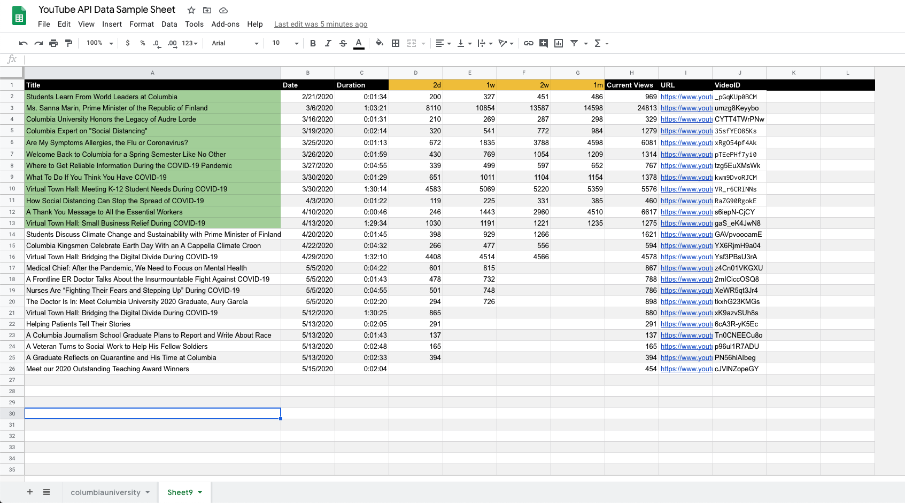

 The JavaScript files in the repository are written with Google Apps Script API and YouTube Data API in order to aumatically scrap YouTube video metadata and store the data in Google Spread Sheet for data mining project.

<h2>ImportVideoData.js</h2>

The script imports list of uploaded video of a Youtube channel during the degignaed period of time 
and writes the data into an active spreadsheet.

1. Add Youtube username as the sheet name that you want to write the data.

2. Creat a new script at **Tool->Script Editor** and paste the script code.
3. Activate Youtube Data API at **Resources->Advanced Google services**

4. Run the script

<a href="https://docs.google.com/spreadsheets/d/1G987QElFnEt3IbYIj_c3mqp-Bm9JrMBhw39osV0fqEQ/edit?usp=sharing">Link to sample spredsheet</a>

<h2>ViewCountTracker.js</h2>

The script has two main functionality.  
1) YTAPINewVideoDetetor(): Request YouTube API to see if there is a newly updated video in a YouTube Channel and write the metadata of video in an active spread sheet.  
2) dataWriter(): Update the view counts of each video in the list and log view count on 2nd, 7th, 14th, 31th days since the video first posted.  
  

<a href="https://docs.google.com/spreadsheets/d/1G987QElFnEt3IbYIj_c3mqp-Bm9JrMBhw39osV0fqEQ/edit#gid=930878025">Link to sample spredsheet</a>

