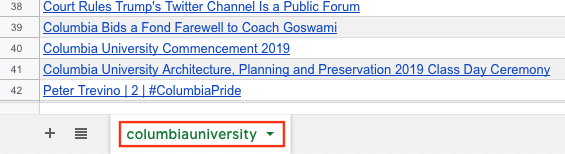
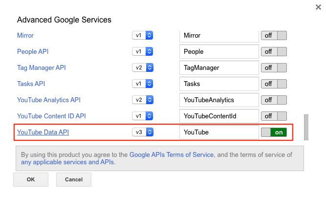
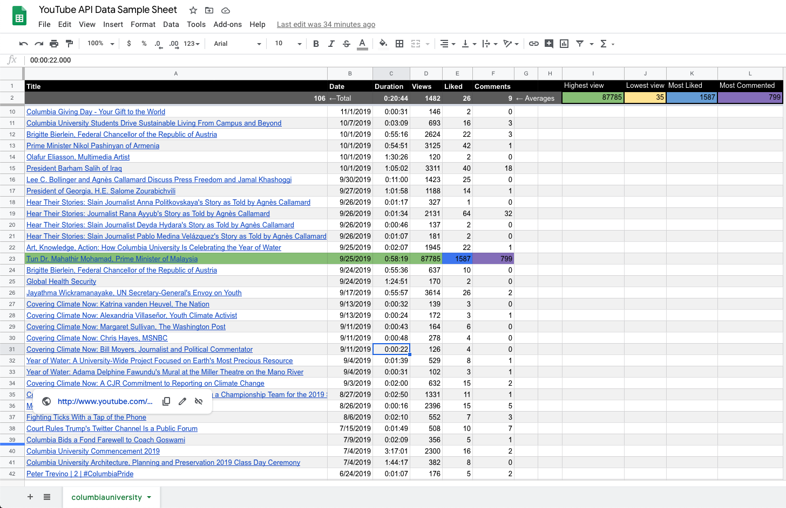

<h2>importVideoData.js</h2>

The script imports list of uploaded video of a Youtube channel during the degignaed period of time 
and writes the data into an active spreadsheet.

1. Add Youtube username as the sheet name that you want to write the data.

2. Creat a new script at **Tool->Script Editor** and paste the script code.
3. Activate Youtube Data API at **Resources->Advanced Google services**

4. Run the script

<a href="https://docs.google.com/spreadsheets/d/1G987QElFnEt3IbYIj_c3mqp-Bm9JrMBhw39osV0fqEQ/edit?usp=sharing">Link to sample spredsheet</a>

<h4>importVideoData.js</h4>
